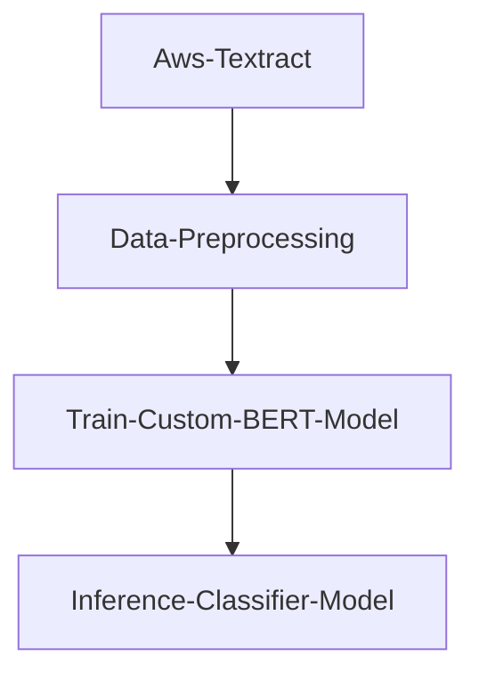

# AppliedDataScience
A  repository to practice data science projects.

## Potato-disease-classification
- Download dataset from [Kaggle](https://www.kaggle.com/datasets/arjuntejaswi/plant-village)
- The dataset contains images of healthy and diseased potato leaves. We are classifying the images into healthy, early disease, bad diseased using CNN.
- If you'd like to run the code, download the dataset and add it to the project folder. (potato-disease/training/PlantVillage/)
  
  **Folder:** ***`potato-disease/`*** 

## Cancer-classification
- Download dataset from [Kaggle](https://www.kaggle.com/datasets/rahmasleam/breast-cancer)
- We are classifying a patient into having cancer with a NN and feature engineering using the dataset.
- If you'd like to run the code, download the dataset and add it to the project folder. (cancer-detection/training/)

  **Folder:** ***`cancer-detection/`***

## Document-classification
- Using transfer learning on BERT to classify documents into categories. Freezing the encoder layer and training the classifier layer, due to data limitations. 

